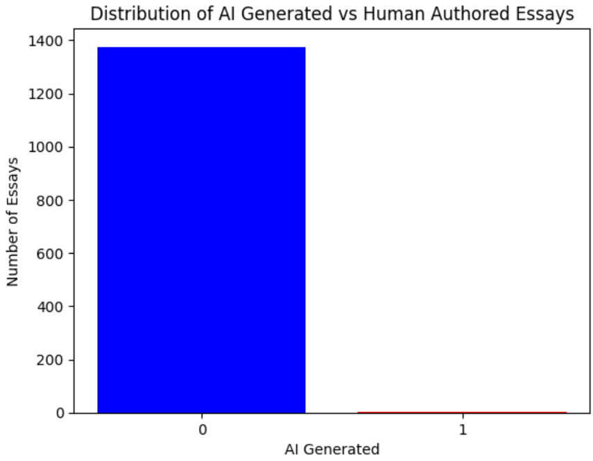
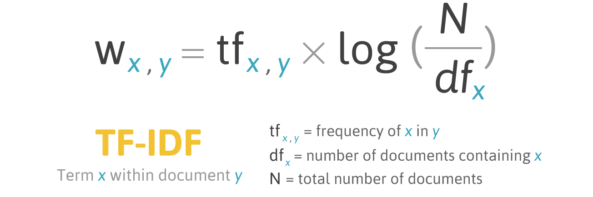
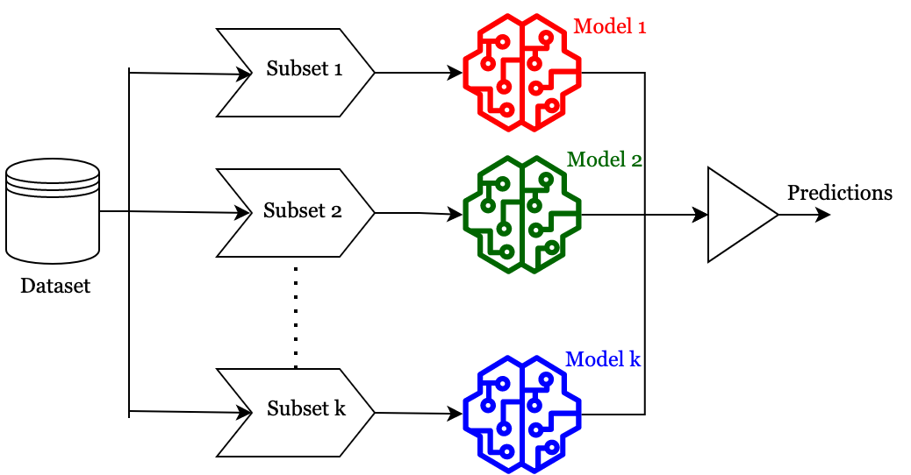
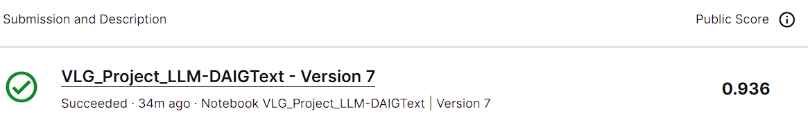

# End Evaluation Report: Detect AI Generated Text

**Author:** Siddhant Rohila  
**Date:** January 2024

## Introduction
The objective of this project is to develop a machine learning model capable of detecting whether an essay was written by a student or was developed by a large language model. The approach involves utilizing a Byte-Pair Encoding tokenizer from the Hugging Face tokenizer library for pre-processing, feature extraction with TF-IDF (term frequency-inverse document frequency), ensemble model for classification which combines logistic regression and stochastic gradient descent classifier.

## Methodology
### Data Collection
The dataset used for training and evaluation consists of a diverse set of text samples, including both human-generated and AI-generated text. The original training dataset is quite uneven, following bar chart is evidence for that.

I've imported an external train dataset `daigt-v2-train-dataset' using the pandas library, providing a good distribution of essays for the model training since it has a generated: student-written ratio of 45.6:54.4.

### Pre-Processing
For natural language processing tasks, the given essays cannot be used directly; they must be changed into a suitable format including a sequence of subword units. Using the Hugging Face tokenizer library, a Byte-Pair encoding tokenizer is employed to break down text into meaningful subword units. This involves normalization and pre-tokenization and further, training the tokenizer. The training process involves iterating through the dataset in chunks of 1000 samples.

### Feature Extraction
Term Frequency-Inverse Document Frequency (TF-IDF) vectorization is a technique used for representing text data in a numerical format and capturing the significance of terms in the context of each document. Now since the test data is tokenized, it is ready for TF-IDF vectorization.

Tasks implemented for this include:
- Creating a vectorizer object involving certain parameters like ngram_range, lowercase (for preserving the case of the text), token_pattern, etc.
- The vectorizer is then fitted to the tokenized test data, and then the vocabulary learned from the test data is obtained.
- Memory cleanup and resource management using garbage collector.

### Model Training
This part is implemented by training an ensemble model, i.e., multiple diverse models are used to predict the outcome. The ensemble consists of a Logistic Regression model and a Stochastic Gradient Descent (SGD) Classifier.

It is obvious that the given data requires binary classification. Finally, I have used the following for model training:

- **Logistic Regression:** A process of modeling the probability of a discrete outcome given an input variable. The logistic regression model uses the sigmoid function (also known as the logistic function) to map the output to a value between 0 and 1.
$$S(z) = \frac{1}{1+e^{-z}}$$

- **Stochastic Gradient Descent Classifier (SGD):** SGD is an optimization algorithm used to minimize the cost or loss function during the training of a machine learning model. It is a variant of the gradient descent algorithm. It is suitable for both convex and non-convex optimization problems, and thus, I employed it in my ensemble model.

The ensemble model is trained using the fit method with the TF-IDF transformed training data and corresponding labels. Memory cleanup and resource management using a garbage collector.

## Results
My Kaggle submission has shown an accuracy of 93.6%. I enjoyed making this machine learning model.

